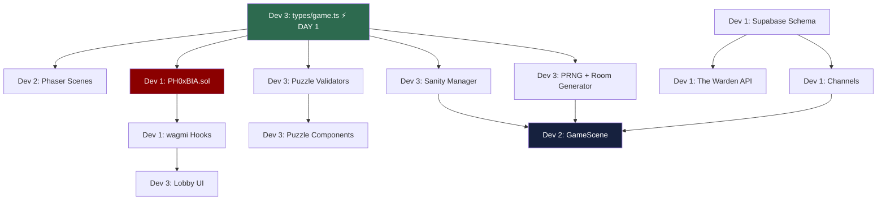

# PH0xBIA — Implementation Plan (3-Developer Split)

> Monad Hackathon 2026 · Horror-themed on-chain escape room

---

## Developer Assignments

| Dev | Focus Area | Key Deliverables |
|-----|-----------|-----------------|
| **Dev 1 — Chain & Backend** | Smart contract, deploy, backend signer, Supabase, wagmi hooks | `PH0xBIA.sol`, The Warden API, DB schema, channels, hooks |
| **Dev 2 — Game Engine** | Phaser scenes, lighting, fog-of-war, ghost NPCs, audio, multiplayer sync | All scenes + managers, position sync, particles |
| **Dev 3 — Frontend & Logic** | Next.js app, puzzles, co-op overlays, HUD, sanity, PRNG, room generator | Landing, lobby, all UI components, game logic libs |

---

## Dev 1 — Chain & Backend

#### [NEW] `contracts/PH0xBIA.sol`
- Session/Coven structs, `createSession()`, `joinSession()`, `startSession()` (curse seed)
- `markEscaped()` with ECDSA (The Warden), `claimReward()` (solo + co-op), `expireSession()`, `emergencyWithdraw()`
- 2.5% Asylum's Tithe, all events

#### [NEW] `contracts/deploy.ts`
- Hardhat deploy script for Monad testnet

#### [NEW] `test/MonadEscapeRoom.test.ts`
- Full contract test suite (create, join, escape, claim, expire, emergency)

#### [NEW] `supabase/schema.sql`
- Tables: `sessions`, `session_covens`, `session_players`, `task_state`, `player_positions`, `sanity_events`

#### [NEW] `supabase/rls.sql`

#### [NEW] `app/api/sign-escape/route.ts`
- The Warden — verify 3 puzzles solved, return ECDSA sig

#### [NEW] `lib/supabase/channels.ts`
- Presence, position broadcast (>4px delta), chat, sanity, task_state listeners

#### [NEW] `hooks/useEscapeRoom.ts`
- All wagmi hooks: create/join/start session, escape, claim, expire, read seed/state

#### [NEW] `scripts/setup-env.sh`

---

## Dev 2 — Game Engine

#### [NEW] `scenes/BootScene.ts` / `scenes/PreloadScene.ts`
- Asset loading, horror-themed loading bar

#### [NEW] `scenes/IntroScene.ts`
- 5-second asylum hallway pan + text overlay

#### [NEW] `scenes/GameScene.ts`
- Main orchestrator: tilemap, player (WASD + click-to-walk), hotspots, remote phantom rendering

#### [NEW] `scenes/ResultScene.ts`
- Win / Loss / Timeout screens with horror atmosphere

#### [NEW] `scenes/managers/LightingManager.ts`
- Flashlight (128px/192px), flickering, blackout events

#### [NEW] `scenes/managers/FogOfWarManager.ts`
- Unexplored = black, minimap fog overlay

#### [NEW] `scenes/managers/GhostNPCManager.ts`
- 2–3 ghosts, seed-determined patrols, wall-phasing, sanity drain on contact (-10%, 2s slow)

#### [NEW] `scenes/managers/AudioManager.ts`
- Ambient layers, proximity whispers/heartbeat, stingers, co-op radio static

#### [NEW] `scenes/managers/ParticleManager.ts`
- Dust, embers, flies, dripping water

#### Multiplayer Sync (in GameScene)
- Remote phantoms (blue = same coven, red = rival), 10fps delta broadcast, reconnect recovery

---

## Dev 3 — Frontend & Game Logic

#### [NEW] `types/game.ts`
- All shared TypeScript types (Session, Coven, WardConfig, PuzzleConfig, SanityState, GhostPath, etc.)

> [!IMPORTANT]
> **Must be delivered Day 1** — both other devs depend on these types.

#### [NEW] `lib/prng.ts`
- mulberry32 + seeded helpers (pick, shuffle, float, int)

#### [NEW] `lib/roomGenerator.ts`
- `generateWard(seedHex, isCoOp)` → puzzles, tasks, horror objects, ghost paths, scares, blackouts

#### [NEW] `lib/sanity.ts`
- SanityManager: drain/recover, threshold effects at 75/50/25/0%, configurable rates

#### [NEW] `lib/puzzles/index.ts`
- All 6 validators: BloodCipher, PatientNumbers, EVPRecording, BinaryLocks, RitualSequence, PatientAnagram

#### [NEW] `app/page.tsx`
- Landing: "ASHWORTH ASYLUM" — fog, lightning, glitchy title, rusted connect button

#### [NEW] `app/lobby/page.tsx`
- Solo/co-op session creation & join flow

#### [NEW] `app/layout.tsx`
- Dark horror theme, Creepster + Inter fonts, wagmi/RainbowKit providers

#### [NEW] `components/puzzles/*.tsx`
- 6 horror puzzle UIs: grimy aesthetic, blood/rust, wrong=red flash, correct=green glow, 30s lockout

#### [NEW] `components/CoopTaskOverlay.tsx`
- Whisper Code, Séance Circle, Possessed Relay, Blood Ritual Levers

#### [NEW] `components/HUD.tsx`
- Sanity bar, timer (clock face), patient file, coven status, minimap

#### [NEW] `components/SanityEffects.tsx` / `components/JumpScare.tsx`
- Vignette, grain, chromatic aberration overlays; scare overlay + stinger

#### [NEW] `components/ChatWidget.tsx`
- Séance chat (old radio style, co-op only)

---

## Dependency Graph



---

## Verification Plan

### Automated Tests
```bash
npx hardhat test                    # Contract tests (Dev 1)
pnpm vitest run                     # Unit: PRNG, puzzles, sanity, payout (Dev 3)
pnpm vitest run test/integration    # Supabase channels (Dev 1, requires: supabase start)
npx playwright test                 # E2E full flow (all devs)
```

### Manual Verification
1. Deploy to Monad testnet → create session → join → escape → claim reward → verify balances
2. GameScene in browser → confirm flashlight, fog, ghosts, ambient audio
3. Interact with red herrings → confirm sanity effects at 75/50/25/0%
4. Solve each puzzle type → verify horror UI, lockout, feedback
5. Two browsers, co-op Séance Circle → verify 5s sync window
6. Full solo flow: start → investigate → solve 3 puzzles → escape → claim on-chain
